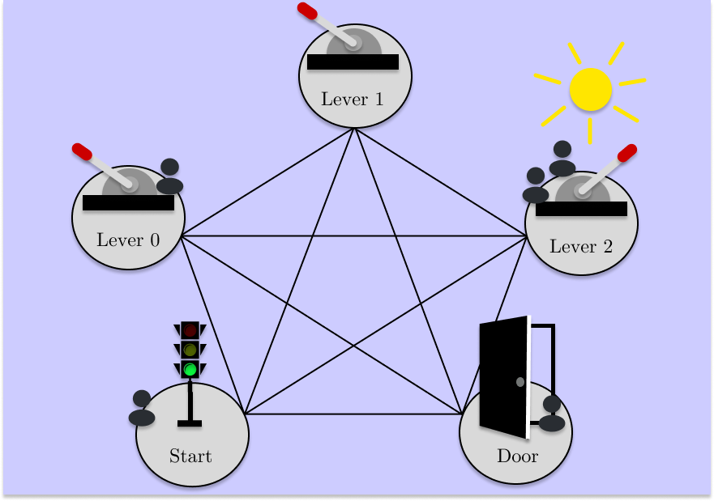

# Large Legislative Models

This repository contains an implementation of Large Legislative Models, a **novel LLM-based automated policymaking method**, tested against a variety of baselines in three socially complex multi-agent reinforcement learning environments: Commons Harvest Open, Clean Up and Contextual Escape Room.


<p align="center">
  
  
  
</p>


## Setup

1. Clone this repository.
```
git clone https://github.com/hegasz/large-legislative-models
```

2. Create a new conda environment and activate it.
```
conda create --name py311 python=3.11
conda activate py311
```

3. Run Makefile
```
cd large-legislative-models
make
```

## Usage

Use the main config, in `/config.py`:

```
python large_legislative_models/main.py
```

Or use a config of your own in `/custom_configs`:
```
python large_legislative_models/main.py --config $PWD/custom_configs/example_config.json
```

Or reuse an old config file by specifying the path:
```
large_legislative_models/main.py --config $PWD/runs/<YYYY-MM-DD>---<HH-MM-SS>/config.json
```

Within your config, you can specify tracking preferences, experiment parameters, optimization settings, and more.

LLM prompts go in `/principal/prompts.py`. For models not able to generate JSON structured output, we recommend prompting the LLM to wrap actions (e.g. tax rates) in dollar signs for parsing.

# Structure of the Code

The code repository is organized into the following components:

| Component | Description |
|-----------|-------------|
| [environment](large_legislative_models/environment) | Contains the CER environment and meltingpot environment setup. Environments supported are: Contextual Escape Room (CER) ("cer"), Commons Harvest Open (Harvest) ("commons_harvest__open") and Clean Up ("clean_up"). |
| [neural](large_legislative_models/neural) | Pytorch architectures for agents and principals. |
| [principal](large_legislative_models/principal) | Contains eight principals organised into four categories - including AI Economist ("Dual-RL"), MetaGrad ("AID"), and our LLM principal ("LLM"). Also includes three bandit algorithms: $\epsilon$-greedy ("EpsilonGreedy"), Upper Confidence Bound ("UCB") and Thompson sampling ("ThompsonSampling"); a fixed action "principal" ("Fixed-[...]") and a GP regression "principal" ("GaussianRegression") . |
| [training](large_legislative_models/training) | Training logic: collection and optimization. |
| [utils](large_legislative_models/utils) | Buffers, logger, training context, loss calculation utils (e.g. GAE) and general utils. |

In this repository, agents are trained with parameter sharing and PPO across all environments for code cleanliness. In our paper, CER player agents do not use parameter sharing and are trained with a vanilla policy gradient loss. If you require a (less neat) implementation featuring this, email henry.gasztowtt@cs.ox.ac.uk